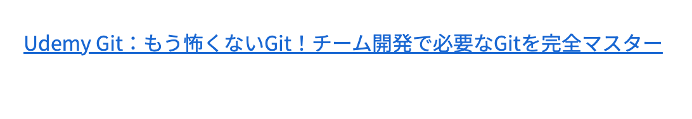
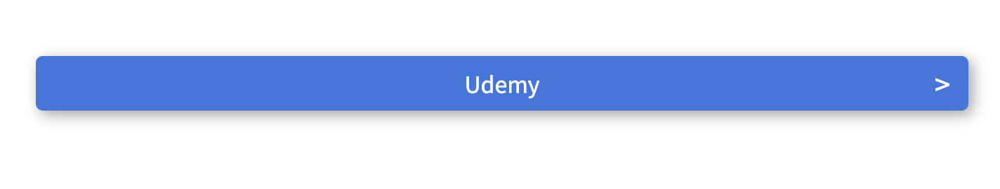
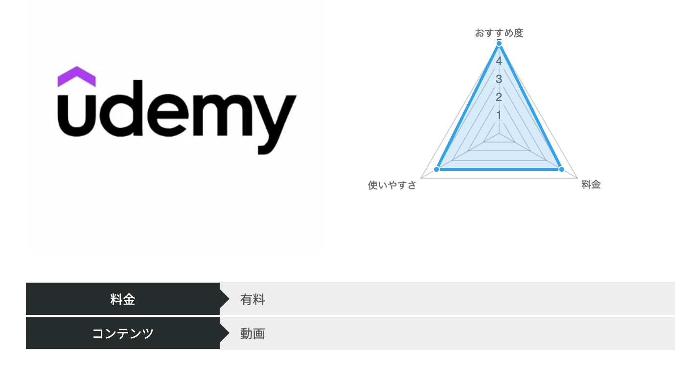
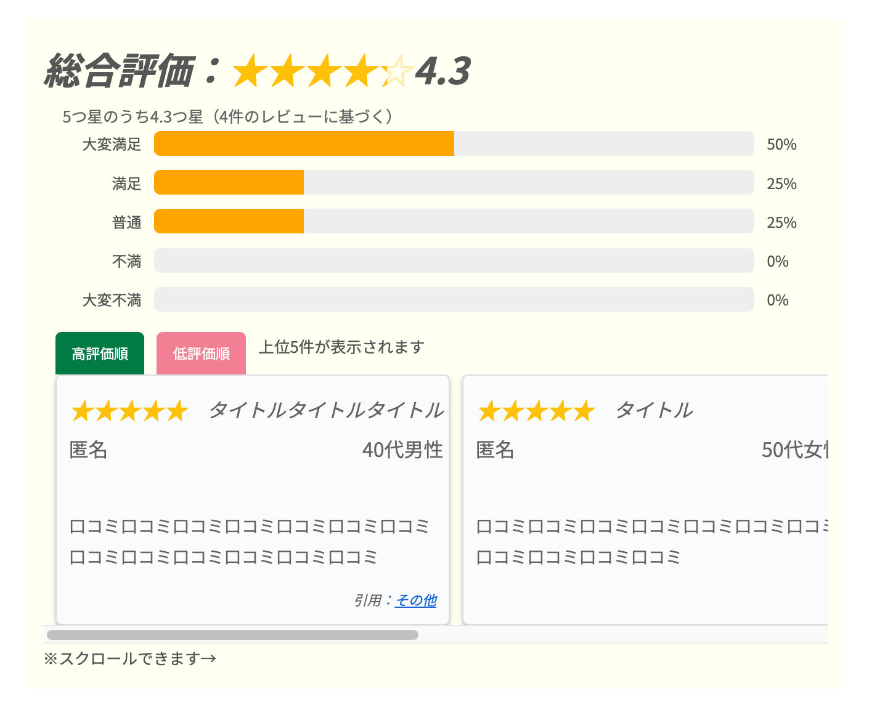
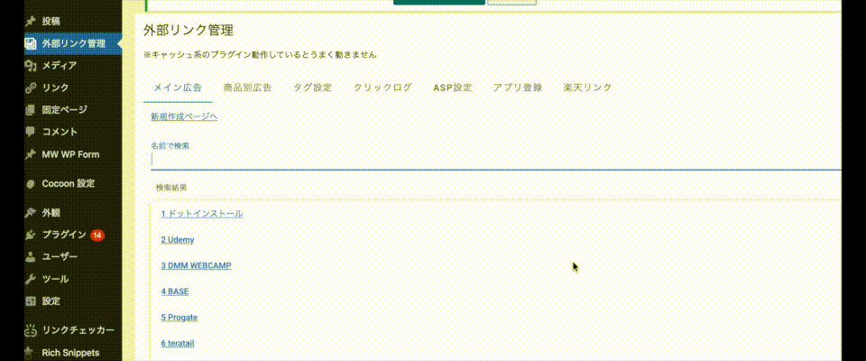

# 外部リンク管理プラグイン (Ajax Snippets)

## 概要

本プラグインは、WordPressサイト内における外部リンクや
コンテンツパーツ（バナー・レビューボックス等）を
一元管理するために開発した管理支援プラグインです。

サイト全体に埋め込まれたリンク情報を
管理画面から統一的に更新できる仕組みを構築し、
保守性・運用効率の向上を目的としています。

---

## 開発背景

アフィリエイト運用時、リンク変更のたびに複数記事を手作業で修正する必要があり、
運用負荷が高いことが課題でした。

この問題を解決するため、リンク情報を中央管理し、
ショートコードによって各記事から参照する仕組みを開発しました。

---

## 解決しようとした課題

- 記事内に分散した外部リンクの管理が煩雑
- リンク変更時に手作業で全記事を修正する必要がある
- 表示パーツの統一管理が困難
- リンク切れの確認が手動
- クリックされている箇所の確認

---

## 主な機能

### 1. ショートコードによるコンテンツ部品化

WordPressの投稿記事内にショートコードを設定することで、
以下を設置することができます。

- テキストリンク（任意の文字列で可能）
- ボタン、画像リンク
- レビューボックス形式の表示パーツ
- 口コミボックスの表示

リンクの遷移先は管理画面で一括変更可能になるため、
複数箇所に配置している場合など更新が簡単になる。

#### 使い方

<figure>
<figcaption><strong>テキストリンク</strong></figcaption>
<pre>ショートコード：<code>[afRecord id=1]Udemy Git：もう怖くないGit！チーム開発で必要なGitを完全マスター[/afRecord]</code></pre>

</figure>

<figure>
<figcaption><strong>ボタン、バナーリンク（ショートコード）</strong></figcaption>
<pre>ショートコード：<code>[afRecord id=1 btn_color="blue"]Udemy[/afRecord]</code></pre>

</figure>

<figure>
<figcaption><strong>バナーリンク</strong></figcaption>
<pre>ショートコード：<code>[afRecordBanner id=1]</code></pre>

</figure>

<figure>
<figcaption><strong>レビューボックス</strong></figcaption>
<pre>ショートコード：<code>[singleReview detail_id=1 color='blue']</code></pre>

</figure>

<figure>
<figcaption><strong>レビューフォーム</strong></figcaption>
<pre>ショートコード：<code>[reviewForm id=1]</code></pre>

</figure>

---

### 2. 管理画面のSPA化（Vue.js）

<figure>
<figcaption><strong>管理画面デモ</strong></figcaption>

</figure>

管理画面の一部を Vue.js で構築し、ページリロードなしで操作できる構造にしました。
UIコンポーネントフレームワーク「Vuetify」を使用し、見やすくてストレスを感じづらい設計にしています。

管理画面での機能

- リンク情報の編集
- 商品の口コミやレビューに関する編集
- クリック箇所の計測
- 状態確認

---

### 3. Cronによる定期巡回

- 外部リンクの定期チェック
- リンク切れの検知

リンク切れがある場所は更新が必要となるため、Cronによる定期巡回も行えるようにしました。
自動化により運用負荷を軽減する設計です。

CronではcURLにてHTTPステータスを取得し、404・タイムアウトを検知する仕組みを実装しています。

---

## ディレクトリ構成（主要部分のみ）

```bash
ajax-snippets/
├ Api/                  # REST API・アプリケーション層
│  ├ Application/      # ユースケース
│  ├ Controllers/      # APIコントローラー
│  ├ Domain/           # ドメインモデル
│  ├ Infrastructure/   # DB・外部依存
│  └ Store/            # データ保持・状態管理
├ assets/               # 画像・静的ファイル
│  └ images/           # ドキュメント用画像
├ Cron/                 # 定期リンクチェック処理
├ Database/             # DB関連
├ tests/                # PHPUnit
├ Views/                # UIテンプレート
│  ├ AdminViews/       # 管理画面
│  ├ EditorViews/      # 投稿編集画面
│  └ UserViews/        # フロント表示
├ ajax-snippets.php     # プラグインエントリーポイント
├ routes.php            # REST APIルーティング
├ test.sh               # PHPUnitによるテスト用のシェルスクリプト
├ up.sh                 # 環境構築用のシェルスクリプト
└ docker-compose.yml
```

## 管理画面の起動手順（開発者向け）

```bash
composer install
sh up.sh
```

`up.sh` は Docker 環境の起動から WordPress 初期設定、
プラグインの有効化、テスト環境構築までを自動化するスクリプトです。
WordPress 環境構築の手順を削減し、開発開始までの時間を短縮するため自動化しました。

このスクリプトでは以下を自動化しています。

- Docker コンテナのビルド・起動
- WordPress の自動インストール（WP-CLI）
- 日本語化・タイムゾーン設定
- テーマのインストール
- 必要プラグインのインストール
- 開発中プラグインの有効化
- PHPUnit 用テスト環境構築

---

## 技術スタック

- PHP 8.x
- WordPress REST API（register_rest_route）
- Vue.js 2.x
- axios（非同期通信）
- Cron
- Docker
- PHPUnit
- Git / GitHub

---

## 設計上の工夫

### 1. 責務の分離

- 管理画面ロジック
- Ajax処理
- Cron処理
- 表示ロジック

をクラス単位で分離。

機能追加時の影響範囲を限定できる構造にしています。

---

### 2. 変更に強い設計

リンク情報は中央管理し、
記事側は「識別子参照」のみとすることで
変更時の改修範囲を最小化しました。

これは業務システムにおける
マスタ管理思想を意識しています。

---

### 3. テスト環境の整備

- Dockerによる再現可能な開発環境
- PHPUnitによる単体テスト実装

継続的な保守を前提とした構成にしています。

---

## 今後の改善

- Gutenberg対応
- E2Eテスト追加